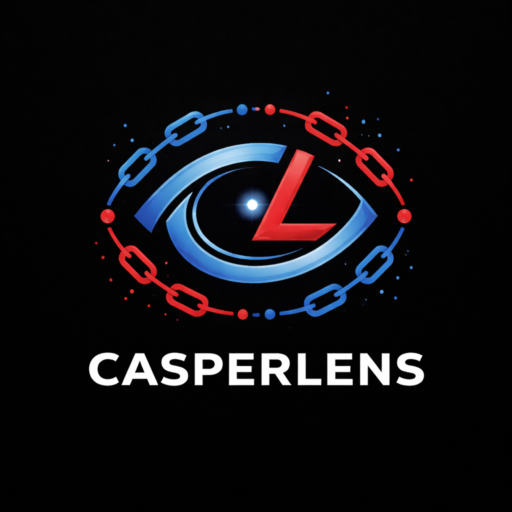
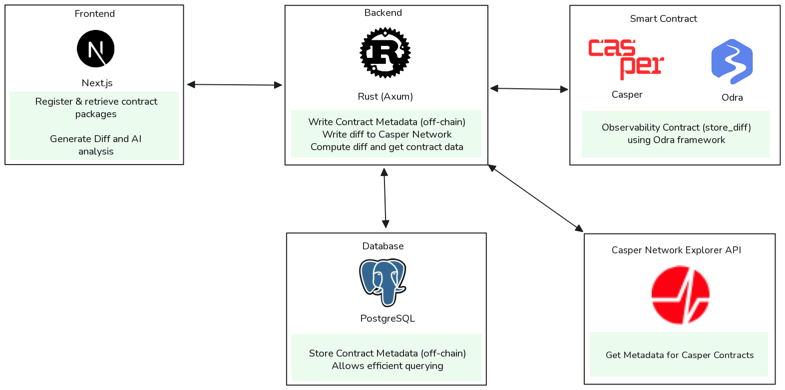
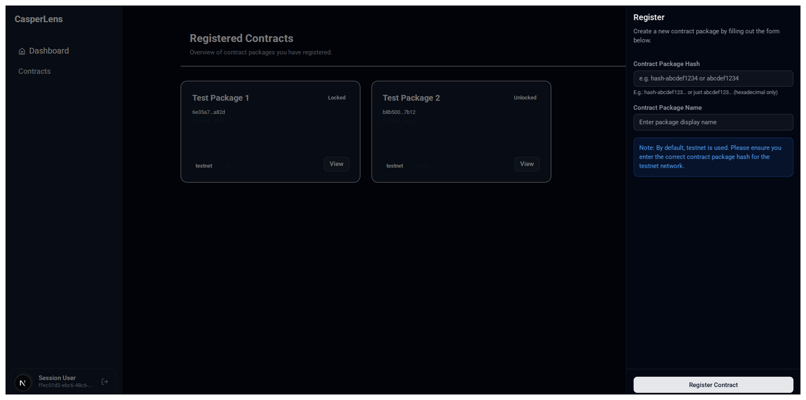
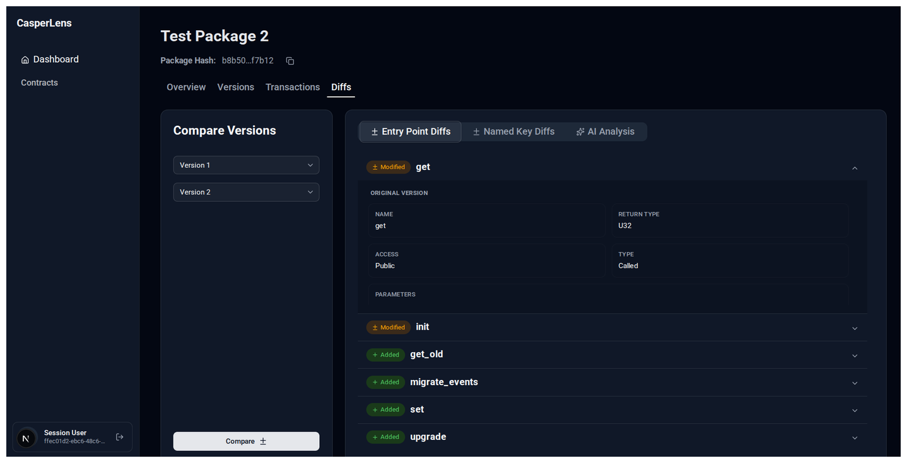
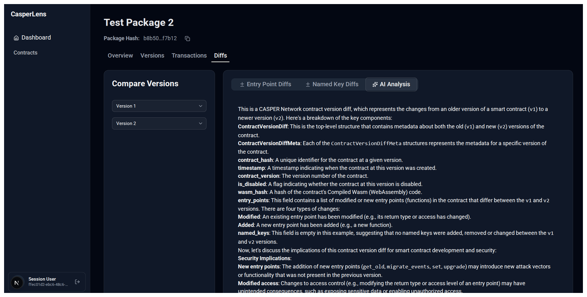

  

# CasperLens

- [Demo](https://casperlens-taupe.vercel.app)
- [Demo video](https://www.youtube.com/watch?v=W8lgBpUf6is)
- [Testnet Deployment](https://testnet.cspr.live/contract-package/6e35a78092c116c3178d8c6408e59e1eb486d060b9694c1ba1b560a60ec1a82d)

CasperLens is an observability and smart contract lifecycle management platform for the Casper Network.

# Table of Contents

- [Why?](#why)
- [Solution](#solution)
  - [Smart contract tracking](#smart-contract-tracking)
  - [Version difference analysis](#version-difference-analysis)
  - [Intelligent Analysis](#intelligent-analysis)
- [Architecture](#architecture)
- [Technologies Used](#technologies-used)
- [Screenshots](#screenshots)
- [Development](#development)
- [Future Enhancements](#future-enhancements)
- [License](#license)

# Why?

Smart contract lifecycle monitoring and management is essential for ensuring smooth integration in application, auditing for security and integrity and continuous evolution with collective knowledge.

Casper, as a newer and efficient blockchain network allows upgrading smart contracts after deployment, in contrast to other networks such as Ethereum.

However, lack of lifecycle tracking and robust observability of the smart contracts in a transparent manner that preserves integrity causes issues during integration in application development teams and proper analysis of usage of the smart contracts.

# Solution

## Smart contract tracking

CasperLens simplifies the process of smart contract lifecycle and changelog management by tracking smart contracts deployed on Mainnet and Testnet, allowing an inventory of contracts to be tracked, that is either developed or used.

This helps in checking the evolution of smart contracts over a period of time, improving accountability and transparency, as intended in Web3 ecosystem.

This provides a centralized mechanism for retrieval of smart contract information such as entry points, parameters, named keys, timestamps, owner, lock status, etc. by integrating data from Casper's RPC nodes and Network Explorer's API endpoints.

## Version difference analysis

CasperLens allows checking for changes between 2 different versions of a smart contract package, aiding in understanding and analysis of differences between versions. This simplifies integration in development teams and improves the process of security auditing for compliance.

The metadata of the versions are stored in off-chain PostgreSQL database for efficient querying and the diff is stored in the Casper Network for transparency.

## Intelligent Analysis

CasperLens provided AI-assisted analysis for differences between 2 versions by providing insights on the changelog and its implications for development teams and security. This improves secure SDLC and efficiency in teams working on smart contract development and integration. It uses HuggingFace inference points with LLaMa for this.

## Package Insights and Visualizations

Contract package usage can be visualized in graphical manner in frontend for observability analysis. This helps in understanding trends without having to build custom systems for inspecting transaction patterns.

## Transaction Tracking

The recent transactions made for the specific contract version can be tracked for understanding usage patterns and status of the invocations.

# Architecture

# Technologies Used

1. **Frontend:** The web interface for CasperLens is written with Next.js and Base UI for an interactive experience.
2. **Backend:** The server is written using Axum, allowing interaction with the Casper Network using Casper Client. The data is written to off-chain PostgreSQL database for smart contract package and version and the version diff data is written to the Casper Network.
3. **Smart Contract Framework:** Observability contract for writing diff is written to Casper network's chain using Odra Framework, allowing easier iterations.

# Screenshots

|                Dashboard                |                 Contract Registration                  |
| :-------------------------------------: | :----------------------------------------------------: |
|  |  |

|                Contract Details                |                Contract Versions                |
| :--------------------------------------------: | :---------------------------------------------: |
|  |  |

|                  Transactions                  |              Contract Version Diffs               |
| :--------------------------------------------: | :-----------------------------------------------: |
|  |  |

|             AI Analysis             |     |
| :---------------------------------: | :-: |
|  |     |

# Development

Check out our [contributing guide](/CONTRIBUTING.md) for getting started.

# Future Enhancements

1. Integrate observability metrics from Casper Cloud.
2. Integrating support for other networks to enable interoperability.
3. Support user account and tracking contracts under a user account using Casper Wallet.
4. Enable code level tracking for functional changes and ABI changes for enhanced intelligent analysis using CI integration.

# License

CasperLens is licensed under Apache-2.0 license. For more information, check out [LICENSE](/LICENSE).
